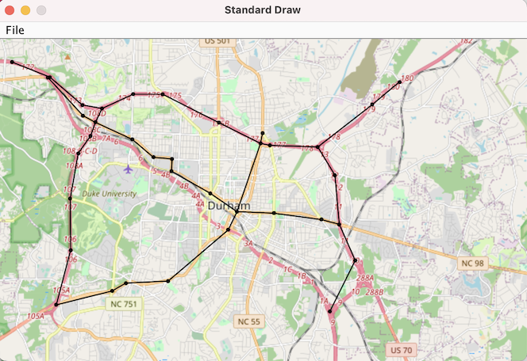

# Route Navigator - US Highway Network

This project is a demonstration of data structures and algorithms implemented in Java, specifically applied to the real-world problem of finding the shortest path between two U.S. cities in a highway network.

## Outline 

- [Description](#description)
- [Project Introduction](#project-introduction)
- [My Contributions](#my-contributions)
- [Technologies Used](#technologies-used)
- [Demo](#demo)

## Description

In this project, I used a graph data structure to represent the U.S. highway network. Each city is a vertex in the graph and each highway connecting two cities is an edge. The weight of the edge is the distance between the two cities. The shortest path between two cities was calculated using Dijkstra's algorithm.

  

## Project Introduction

This project implements a routing service that represents the United States highway network as a graph and calculates routes and distances on this network. At a high level, `GraphProcessor` stores a graph representation and provides public methods to answer connectivity, distance, and pathfinding queries. The `main` method in `GraphProcessor` produces a minimal viable product (MVP) demonstrating the functionality of `GraphProcessor` and visualizing the results. 

## My Contributions

I started with some skeleton code provided by Professor Brandon Fain (Duke University) and then added the necessary functionality to read the data from `usa.graph` and `uscities.csv`, initialize the graph, find the nearest vertices to the user-specified cities, calculate the shortest path between those vertices, and visualize the route on a map of the USA.

Here are some highlights of my work:

- Wrote the logic for parsing the `usa.graph` and `uscities.csv` files and initializing the graph data structure.
- Implemented the functionality for the user to indicate two cities either by their names or by their coordinates. 
- Developed the algorithm to find the nearest vertex in the graph to each of the user-specified cities.
- Used Dijkstra's algorithm to calculate the shortest path between the two vertices.
- Calculated the total distance of the route in miles.
- Measured the time taken to calculate the closest points, shortest path, and distance along the path.
- Used the `Visualize` class to generate a visualization of the route on a map of the USA.

## Technologies Used

- Java SE 17
- Dijkstra's Algorithm
- Graph Data Structure

## Demo

  

A demonstration of the project is available [here](https://github.com/anirudhjain26/Route-Navigator/blob/main/Project%206%20-%20Route%20-%20Demo%20Recording%20.mp4). In the video, I walk through the functionality of the project, explaining how to specify the cities, how the program calculates the route, and how it visualizes the route on the map.

