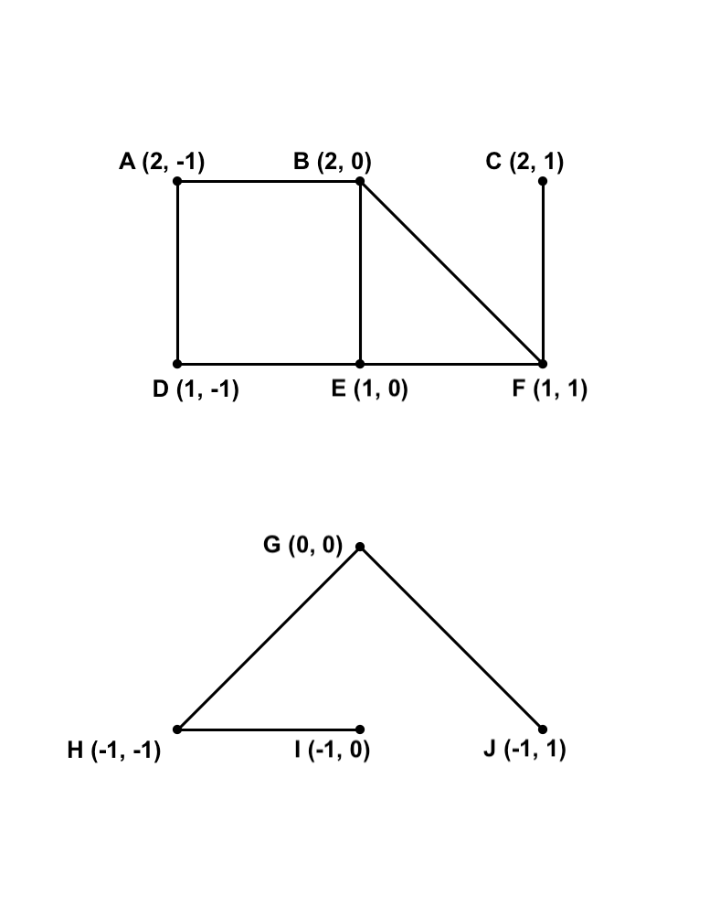

# Project 6: Route

This is the directions document for Project 6 Route in CompSci 201 at Duke University, Fall 2022. 

## Outline 

- [Project Introduction](#project-introduction)
    - [The `Point` Class](#the-point-class)
    - [The `Visualize` Class](#the-visualize-class)
    - [Graph Data](#graph-data)
- [Part 1: Implementing `GraphProcessor`](#part-1-implementing-graphprocessor)
- [Part 2: Creating `GraphDemo`](#part-2-creating-graphdemo)

## Project Introduction

In this project you are asked to implement a routing service that represents the United States highway network as a graph and calculates routes and distances on this network. At a high level, in part 1 you will implement `GraphProcessor` which stores a graph representation and provides public methods to answer connectivity, distance, and pathfinding queries. This part of the project will be autograded as per usual. 

In part 2 you will implement a `main` method in `GraphProcessor` that produces a minimal viable product (also known as MVP) demonstrating the functionality of `GraphProcessor` and visualizing the results. For this part, you will record a brief demo of you or someone else *using* your program to find and visualize a route. [See this video](https://duke.hosted.panopto.com/Panopto/Pages/Viewer.aspx?id=d3f2cc7a-902a-499f-850b-af4e014f8a07) for an example of a completed `GraphDemo` at work.

There is no analysis for this project.

The rest of this section introduces you to the starter code, especially the `Point` and `Visualize` classes, as well as the graph data we will be using.

### The `Point` Class

You are provided in the starter code with `Point.java` that represents an immutable (meaning it cannot be changed after creation) point on the Earth's surface. Each such point consists of a [latitude](https://en.wikipedia.org/wiki/Latitude), or north-south angle relative to the equator, and a [longitude](https://en.wikipedia.org/wiki/Longitude), or east-west angle relative to the prime meridian. We use the convention whereby **latitudes and longitudes are both measured in degrees between -180.0 and 180.0**, where positive latitudes are for north of the equator and negative latitudes are for south of the equator. Similarly, positive longitudes are for east of the prime meridian, and negative longitudes are for west of the equator. 

Vertices/nodes in the graph we will use to represent the United States highway system will be `Point` objects. You should not need to do edit anything in the `Point` class. However, you may wish to use the various methods that are supplied for you. These methods are described in more detail in the expandable section below.

### The `Visualize` Class

One of the things you will be asked to do in your ultimate demo is create visualizations of the route(s) computed by your algorithms. To do this, you are provided with `Visualize.java` (which, in turn, uses `StdDraw.java`, though you won't need to directly call anything from this). You do not need to edit the `Visualize` class, though you will use it. The Visualize class is described in more detail in the expandable sectios below.

### Graph Data

A graph consists of a number of vertices/nodes and the connections between them (known as edges). Our data represents highway networks, where vertices/nodes are points (see the [`Point` class](#the-point-class)) on the Earth's surface (think of them as intersections of highways) and the edges represent road segments. Our graph is **undirected**, meaning we assume every edge can be traversed in either direction. Our graph is also **weighted**, meaning the edges are not all of the same length. **The weight of an edge is the straight-line distance between its endpoints**, see [the `Point` class](#the-point-class) for the `distance` method.

The data we work with was originally pulled from the [METAL project by Dr. James D. Teresco](https://courses.teresco.org/metal/graph-formats.shtml). This data is intended for educational use only and not for any commercial purposes. It has been slightly modified and stored as `.graph` files inside of the `data` folder. Three `.graph` files are supplied, the first two are small and intended for development, testing, and debugging, and the third is much larger and intended for use in the final demo. All three have corresponding `.vis` and `.png` files for use with `Visualize`.

1. `simple.graph` contains a small abstract graph (meaning not a real road network) with ten nodes and ten edges. A visualization is shown below at the left. We recommend using `simple.graph` while developing/debugging your project, as it is much easier to reason about and you don't need to worry much about efficiency.

2. `durham.graph` contains a small but real-world graph, a subset of `usa.graph` that lies within the downtown Durham area. A visualization is shown below at the right. Note that now the graph is imposed on a real image of the road network of Durham instead of an abstract background. We recommend testing on `durham.graph` after you feel comfortable that your code is working on `simple.graph`.

<div align="center">
  
  
</div>

3. `usa.graph` contains over 85 thousand vertices and edges representing the (continental) United States Highway Network. This is the network on which you will ultimately produce your demo, and for which the efficiency or not of your implementations may become noticeable.

The format of a `.graph` file is described in more detail in the expandable section below.

## Part 1: Implementing `GraphProcessor`

In this part you will implement `GraphProcessor`, which stores a graph representation and provides public methods to answer connectivity, distance, and pathfinding queries. This part of the project will be autograded. To pass autograder compilation, you must write your `GraphProcessor` implemention entirely within the provided `GraphProcessor.java` file. If you use helper classes, they should be included in the file as nested classes.

The starter code for `GraphProcessor.java` includes five public methods you must implement. Each is described below and also in javadocs inside of the starter code. While these are the only methods you must implement, you are very much *encouraged to create additional helper methods* where convenient for keeping your code organized and to avoid repetitive code. As a rough rule of thumb, if you find yourself writing a method that is longer than fits on your text editor at once (maybe 20-30 lines), or if you find yourself copy/pasting many lines of code, you might consider abstracting some of that away into a helper method. You could even create additional classes to help you implement these methods if you so choose.

### Instance variables

You will need to add instance variables to your `GraphProcessor` to represent a graph, but exactly how to do this is left up to you. Remember that vertices/nodes in the graph should be `Point` objects, see [the `Point` class](#the-point-class). As a hint, your graph representation should allow you to efficiently do things like:
- Check if two vertices are adjacent (meaning there is an edge between them), or
- For a given vertex, lookup/loop over all of its adjacent vertices.  

### Implement `initialize`

This method takes as input a `FileInputStream`. This input stream should be for a file in the [`.graph` format](#graph-data). The method should read the data from the file and create a representation of the graph, **stored in the instance variables** so that the graph representation is avaialble to subsequent method calls. If the file cannot be opened or does not have the correct format, the method throws an `Exception`, for example:
```java
throw new Exception("Could not read .graph file");
```

`initialize` should always be called first before any of the subsequent methods. Make sure to verify that your `initialize` method is working as you expect before proceeding, as an incorrect `initialize` method will also cause problems with later methods. You might consider, for example, implementing a `main` method purely for verification purposes, and printing or using the debugger to view your graph representation of `simple.graph`, comparing to what is visualized in `simpleGraph.png`; see [Graph Data](#graph-data) above.

### Implement `nearestPoint`

In general you may be interested in routing between points that are not themselves vertices of the graph, in which case you need to be able to find the closest points on the graph. This method takes a `Point p` as input and returns the vertex in the graph that is closest to `p`, in terms of the straight-line distance calculated by the `distance` method of [the Point class](#the-point-class), NOT shortest path distance. Note that the input `p` may not be in the graph. If there are ties, you can break them arbitrarily. You may test correctness with `testNearestPoint()` in JUnit.

A simple implementation of the `nearestPoint` method should have $`O(N)`$ runtime complexity where $`N`$ is the number of vertices in the graph. Your implementation should be at least this efficient. It is possible to use more advanced data structures to substantial improve the runtime. This is not required for credit, but if you have completed the project and are interested in optimizing this method to go beyond what is required, see the expandable section below.

### Implement `routeDistance`

This method takes a `List<Point> route` representing a path in the graph as input and should calculate the total distance along that path, starting at the first point and adding the distances from the first to the second point, the second to the third point, and so on. Use the `distance` method of [the `Point` class](#the-point-class). You may test correctness using `testRouteDistance()` in JUnit.

The runtime complexity of the method should be linear in `route.size()`, that is, the number of points on the path. 

### Implement `connected`

This method takes two points `p1` and `p2` and should return `true` if the points are connected, meaning there exists a path in the graph (a sequence of edges) from `p1` to `p2`. Otherwise, the method should return `false`, including if `p1` or `p2` are not themselves points in the graph. You may test correctness using `testConnected()` in JUnit.

This method will require you to search in the graph itself, using, for example, a depth-first search (DFS) or similar approach. The runtime complexity of your implementation should be at most $`O(N+M)`$ where $`N`$ is the number of vertices in the graph and $`M`$ is the number of edges in the graph. In other words, the runtime complexity should be at most linear in the size of the graph. Note that the autograder has efficiency tests for full credit. 

It is possible make the runtime of `connected` much faster than linear by pre-processing the graph during `initialize` to store information about the connected components. This is not required for credit, but if you have completed the project and are interested in optimizing this method to go beyond what is required, see the expandable section below.

### Implement `route`

This method takes two points, `start` and `end`, as input and should return a `List<Point>` representing the **shortest path** from `start` to `end` as a sequence of points. The total distance along a path is the sum of the edge weights, equal to the sum of the straight-line distance between consecutive points (see [implement `routeDistance`](#implement-routedistance)). Note that you must return the path itself, not just the distance along the path. The first point in your returned list should be `start`, and the last point should be `end`. 

If there is no path between `start` and `end`, either because the two points are not in the graph, or because they are the same point, or because they are not connected in the graph, then you should throw an exception, for example: 
```java
throw new InvalidAlgorithmParameterException("No path between start and end");
```

This method will require you to search in the graph itself, and must also take into account the fact that the graph is weighted while searching for shortest paths. You will need to adapt Dijkstra's algorithm to accomplish this: a breadth-first search (BFS) that uses a binary heap instead of a queue to keep track of which vertex to explore next. You can use the `java.util` data structure `PriorityQueue` that implements a binary heap. Note that this data structure does not support operations to change the priority of an element, so instead your implementation should simply `add` an element again any time a new shorter path is discovered, with the corresponding smaller distance. You may test correctness using `testRoute()` in JUnit.

The runtime complexity of your implementation should be at most $`O(N+M) \log(N))`$ where $`N`$ is the number of vertices in the graph, $`M`$ is the number of edges in the graph, and we are assuming that each vertex is connected to at most a constant number of other vertices due to the way we use the `PriorityQueue`. Note that the autograder has efficiency tests for full credit. 

It is possible make the runtime of `route` much faster empirically in the average case (though not asymptotically in the worst case). This is not required for credit, but if you have completed the project and are interested in optimizing this method to go beyond what is required, see the expandable section below.

## Part 2: Creating `GraphDemo`

The starter code for `GraphDemo.java` only includes an empty `main` method. Feel free to organize `GraphDemo` however you see fit - it will not be autograded. **Running your `GraphDemo` `main` method should produce a demonstration of the functionality of your project on the USA highway network, including (at a minimum) the following:** 

1. A user should be able to indicate two cities in the United States. An extensive list of latitude-longitude coordinates for US Cities has been included in `data/uscities.csv` (that the file is a `.csv` means each row contains an entry where the values are separated/delimited by commas `,`). This data was obtained from [simplemaps.com](https://simplemaps.com/data/us-cities) for educational use only. Choose two that are reasonably far apart (say, 1,000 miles or more) for the demo. You can choose how a user indicates cities: They might input the name of the cities, or maybe their coordinates, up to you.

2. For each of the user indicated points, the demo should locate the closest vertex of the road network from `usa.graph`, the large data file containing the highway network of the USA.

3. The demo should calculate a route (shortest path) between the two nearest vertices to the cities indicated by the user.

4. The demo should indicate the total distance (in miles) of the route calculated.

5. The demo should measure and report how long it took (include units) to calculate the closest points, shortest path, and distance along the path (steps 2-4). Do not include the time to read data from `usa.graph` and initialize the graph, nor time waiting on the user to input cities. You can use whatever approach you like for timing, one popular example is [Java's `System.nanoTime()`](https://docs.oracle.com/en/java/javase/17/docs/api/java.base/java/lang/System.html#nanoTime()), and you can see previous projects for examples measuring elapsed time.

6. The demo should generate a visualization of the route calculated projected onto the map of the USA (see `images/usa.png` and `data/usa.vis`). You can do this using the [`Visualize` class](#the-visualize-class).

You should **produce a recording demonstrating your use of `GraphDemo` in at most 5 minutes.** You can use whatever recording software you like. One free option is to simply start a zoom meeting with your free [Duke zoom account](https://oit.duke.edu/what-we-do/applications/zoom-meetings), share your screen, and record (see the [zoom recording documentation](https://support.zoom.us/hc/en-us/sections/200208179-Recording)). You can record locally and then upload somewhere, or you can record directly to the cloud and share a link to that later. 

In your recording, explain what you are doing and what the code is doing while running. You don't need to explain or look at the details of the implementation, but you do need to describe the functionality, similar to what is written above. Imagine that you are speaking to a user (maybe a friend or family member) who is **not** part of Compsci 201 but is interested in what your software does. If you have a partner, both partners should participate in the demo.

**[See this video](https://duke.hosted.panopto.com/Panopto/Pages/Viewer.aspx?id=d3f2cc7a-902a-499f-850b-af4e014f8a07) with an example of a completed `GraphDemo` at work.**
